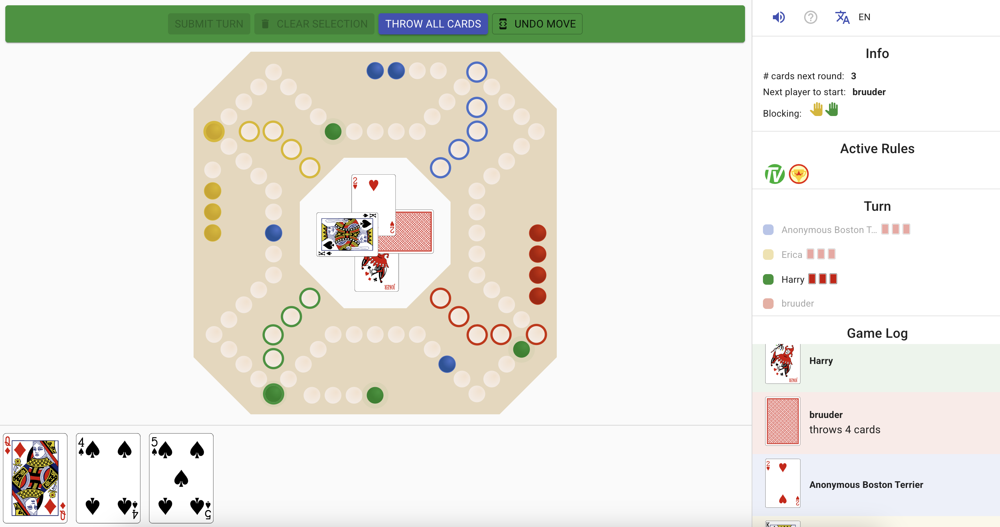
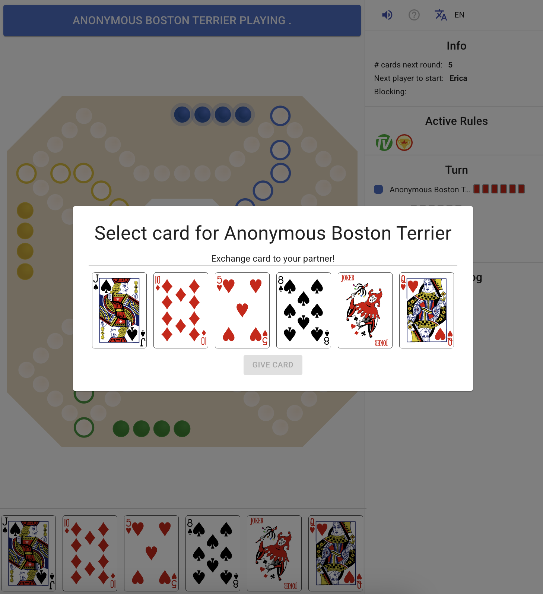

# dog-online

The source code of the real-time firebase Dog game application, built on React. The application is running at https://dogathome.ch.

### About
This project was realized during the Corona pandemic and is the first known online implementation of the DOG game, going live in April 2020.

It was developed to help people socialize while staying at home and for me to practice building a product + getting to know React.

The code is mainly written in JavaScript and located in the `src/` folder. All graphics were created in Adobe Illustrator (before GenAI was capable of helping with that).

### Building
To build this project for development:
- Install npm
- Install packages `npm install`
- Install the firebase CLI `npm install -g firebase-tools`
- run from the home folder `npm run dev`

### Screenshots

